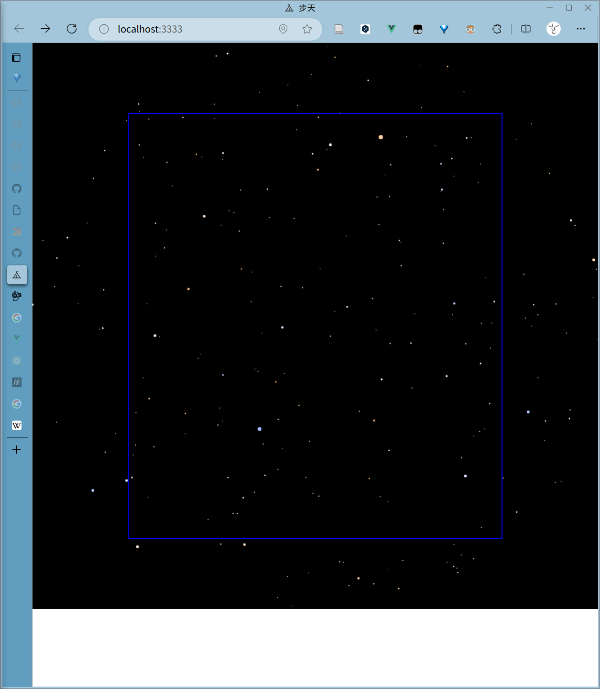

# 步天 sky-wander

中文星图

起手模板vitesse-lite

数据来源 d3-celestial 详见data分支

可视化:

- d3.js
- d3-geo.js
- d3-geo-projection.js

## 显示逻辑

为尽可能呈现出肉眼观测天空的情形，我们做以下约定：

1. 默认观测者直视天顶（地平纬度90°）
2. 将天顶点的地平座标转换为天球赤道座标，得到其赤经与赤纬
3. 人的中央视野区域为0°\~±30°[^1]，因此我们所能看见的星空范围在$ [\text{赤经}-30°,\text{赤经}+30°]\times [\text{赤纬}-30°,\text{赤纬}+30°]$这个球面矩形内
4. 我们将这个天球的这个区域以天顶点为中心，以30°圈为截面做[平展投影](https://en.wikipedia.org/wiki/Equirectangular_projection)，由于天区范围不大，失真较小。
5. 我们将得到一个圆形[^2]（图中星星所在的外轮廓）的投影，它内接于一个正方形（图中黑色区域）中（因为我们的经纬跨度是等比例的），在这个圆角方形中，我们约定一个视野矩形，它是长宽比与画布相同的最大内接矩形（图中蓝色方框），如同我们透过窗口观察这个天空，矩形外的区域被窗口遮挡。注意下图只是示意，最终我们只会将蓝色方框内的星区放大至全窗口[^3]。
   

[^1]: https://vrui-research.gitbook.io/researchonvrui/ergonomic-issues/jie-mian-zui-yu/ren-yan-kan-neng-li
[^2]: 其实是圆角方形。截面圆从0°到90°的平展投影形状是从一个点（退化圆）到方形的连续插值
[^3]: 当然这里的窗口指的实际上是画布canvas，并非浏览器窗口window
